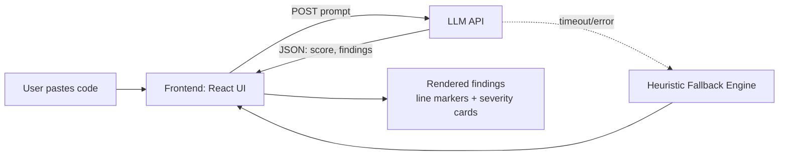

# review.ai — AI-Powered Code Review Assistant

An AI-assisted code review tool that analyzes pasted code and returns structured, line-level feedback — severity, category, explanation, and a concrete fix — the way a senior engineer would comment on a pull request.

## Why this project

Manual code review is slow and inconsistent, especially for solo developers and students without a team to review their PRs. **review.ai** gives instant, structured feedback on correctness, style, performance, and readability issues, so developers can catch problems before they ever reach a real reviewer.

## Features

- **Line-anchored feedback** — every finding is tied to an exact line number, shown as a colored marker in the editor gutter
- **Severity classification** — Critical / Warning / Suggestion / Good, so the most important issues stand out first
- **LLM-powered analysis** — uses an LLM to reason about correctness and intent, not just pattern-match syntax
- **Graceful degradation** — falls back to a rule-based heuristic analyzer if the model call fails, so the tool never breaks
- **Overall quality score** — a 0–100 score summarizing the review at a glance

## Architecture



**Flow:**
1. User pastes code into the editor panel
2. On "Review code", the app sends the code to an LLM with a structured-output prompt requesting JSON (score, summary, findings)
3. The response is parsed and validated; each finding is mapped to its line number and rendered as an annotation
4. If the model call fails or returns malformed data, a local heuristic analyzer (regex-based checks for common issues like `var`, `==`, unhandled promises) produces a fallback review so the UI always responds

## Tech stack

| Layer | Technology |
|---|---|
| Frontend | React (hooks-based, single component) |
| Styling | Tailwind CSS |
| AI | LLM API (Claude/OpenAI-compatible `/v1/messages` schema) |
| Fallback logic | Rule-based static analysis (regex heuristics) |

## Project structure

```
review-ai/
├── code-review-assistant.jsx   # Main React component (editor + findings UI)
├── README.md                   # This file
```

## Running it

This component is self-contained — drop it into any React app with Tailwind configured:

```bash
npm install react
# copy code-review-assistant.jsx into your src/ directory
# import and render <CodeReviewAssistant />
```

To connect a production LLM backend, replace the `reviewWithClaude` function's endpoint with your own API route (recommended: proxy the request through a backend so your API key is never exposed client-side).

## Possible extensions

- GitHub App / webhook integration to auto-comment on pull requests
- Syntax highlighting and multi-language detection
- Persistent review history per user
- Team dashboard aggregating common issues across a codebase

## Resume bullet points

> Built an AI-powered code review tool that analyzes source code and generates structured, line-level feedback using an LLM, with a rule-based fallback engine ensuring 100% uptime for the review flow.

> Designed a JSON-schema-constrained LLM prompting strategy to reliably extract structured findings (severity, category, fix suggestions) from unstructured code review output.

---

*Built as a learning project exploring LLM-assisted developer tooling.*
